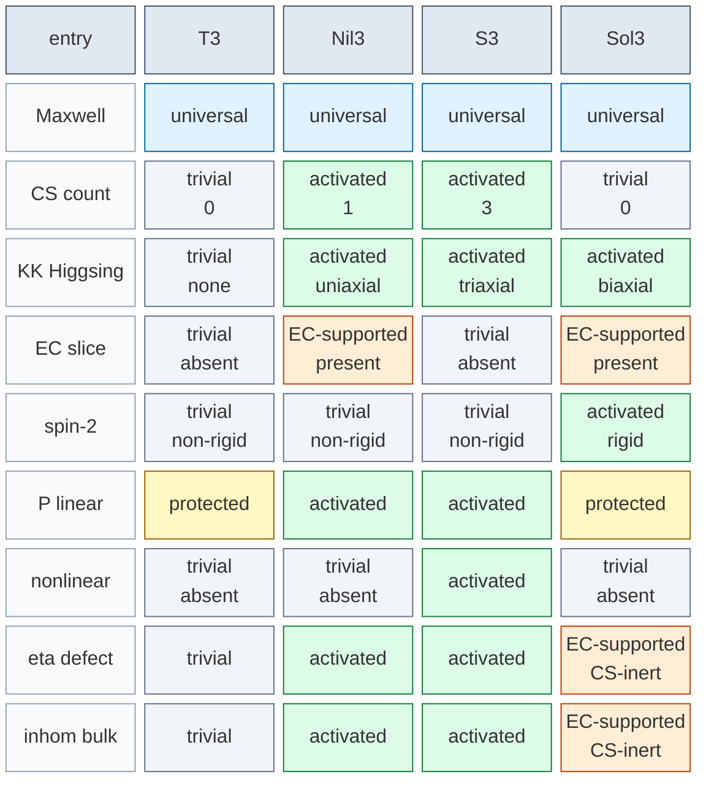

## Appendix B. Full response inventories

本付録では、本文では要約形で提示した full response inventories をまとめる。本文では読みやすさを優先して compact table に圧縮したため、ここでは比較のための全表を一箇所に集める。

### B.1 Bulk inventory

| entry | $T^3$ | $Nil^3$ | $S^3$ | $Sol^3$ |
|---|---|---|---|---|
| Maxwell coefficient | $-L^2/(2r_0^4)$ | $-L^2/(2r_0^4)$ | $-L^2/(2r_0^4)$ | $-L^2/(2r_0^4)$ |
| CS direction count | 0 | 1 | 3 | 0 |
| KK Higgsing | none | uniaxial | triaxial | biaxial |
| EC slice minimum | absent | present | absent | present |
| spin-2 rigidity | non-rigid | non-rigid | non-rigid | rigid |
| P linear transport | protected | activated | activated | protected |
| nonlinear opening | absent | absent | activated | absent |
| defect-localization response ($\eta$ benchmark) | trivial | activated | activated | EC-supported / CS-inert |
| inhomogeneous bulk response | trivial | activated | activated | CS-inert / EC-active |

**Fig. 8.** 36-entry bulk inventory block diagram. 付録 B.1 の 9 entry $\times$ 4 geometry を `universal / activated / protected / trivial / EC-supported` に色分けして表示する。とくに $Sol^3$ は CS count では $T^3$ と同じ trivial 側にあるが、EC slice と inhomogeneous response では EC-supported 側へ分岐する。

Bulk inventory は `universal baseline + geometry-dependent activation` の形をとる。 $Nil^3$ と $S^3$ は local parity-odd response まで activated 側に進み、 $T^3$ は minimal / inert benchmark である。一方 $Sol^3$ は CS direction count では inert だが EC slice minimum と rigid scaffold を持つため、 $T^3$ と同じ minimal class には置かれない。ここで `defect-localization response` ($\eta$ benchmark) の row は、共通の reduced 1D $\eta$-benchmark 自体の bound-state 有無ではなく、その局在化がどの additional structure と結びつくかを記録している。

### B.2 Boundary inventory

| entry | $T^3$ | $Nil^3$ | $S^3$ | $Sol^3$ |
|---|---|---|---|---|
| CS interface jump | absent | present | present | absent |
| APS spectral entry | $0$ | strict $+1/2$ (local) | $0$ | $0/1$ (Sol-A / Sol-P) |
| frame-bundle-normalized torsional charge $N_{\rm top}$ | 0 | 0 | $6r_0^2$ | 0 |
| CZ inflow | absent | activated | activated | absent |
| edge / interface response | minimal | activated | activated | spin-sensitive |
| boundary tag | trivial benchmark | APS local core | torsional-charge active | global spectral branch |

$Nil^3$ の strict observable は local spectral family に属し、 $S^3$ の strict observable は torsional-charge family に属する。さらに $Sol^3$ は compact mapping-torus benchmark では global spectral branch を持ちうる。この区別が pairwise dictionary の mixed pair と source 差を理解する鍵になる。

### B.3 Pairwise cobordism dictionary

| pair | class | dominant observable | not-comparable note |
|---|---|---|---|
| $S^3 \leftrightarrow T^3$ | torsional-trivial | frame-bundle-normalized torsional charge | none |
| $S^3 \leftrightarrow Nil^3$ | torsional-local spectral | mixed | torsional-charge と local spectral は同一量ではない |
| $S^3 \leftrightarrow Sol^3$ | torsional-global spectral | spin-sensitive | Sol-A では torsional-charge 主導, Sol-P では mixed |
| $T^3 \leftrightarrow Nil^3$ | trivial-local spectral | spectral | none |
| $T^3 \leftrightarrow Sol^3$ | trivial-global spectral | spin-sensitive | Sol-A は trivial benchmark, Sol-P は global spectral |
| $Nil^3 \leftrightarrow Sol^3$ | local-global spectral | spectral | 同じ spectral family の source 差 |

pairwise table では、dominant observable が comparison の主語を与える。`not-comparable note` は、observable family が異なるため単純な差し引きが意味を持たない場合と、同じ spectral family の内部でも source が異なる場合を明示する。

### B.4 Strict normalization cores

本節では、boundary observable family と並んで本稿の主結果を支える 3 つの strict normalization core を集約する。これらは [§6.1](DPPUv7-paper04_sec06.md) の reduced-side consistency statements として現れるが、second-layer の新しい observable family を定義するのではなく、Euclidean response dictionary の internal consistency を保証する native quantities である。

| # | core statement | descriptor | status | verification |
|---|---|---|---|---|
| C-1 | $k_{3D}^{\rm tor\text{-}CS} = (1/2) k_{4D}^{\rm NY}$ | $\mathcal{C}_3^{\rm tor}$ inflow normalization | strict (CZ + Stokes) | [E.11](DPPUv7-paper04_appE.md), `proofs/kk_normalization.py` |
| C-2 | $Q_{\rm best} = \eta(0)/\Delta k_{\rm matter} = 1$ | doubly normalization-free quotient | strict (matter assumption minimal) | [E.12](DPPUv7-paper04_appE.md) |
| C-3 | $k_q \in \mathbb{Z}$ | reduced CS level integrality | formal (single-valuedness) | [E.13](DPPUv7-paper04_appE.md) |

#### B.4.1 KK reduction normalization identity (C-1)

4D Nieh-Yan 作用 $S_{\rm NY}^{(4D)} = (k_{4D}^{\rm NY}/8\pi^2)\int_{X^4} {\rm NY}$ に対し、CZ 恒等式 ${\rm NY} = d\mathcal{C}_3^{\rm tor}$ と Stokes 定理を $X^4 = M^3 \times [0, \beta]$ に適用すると、3D 境界上で

$$
S_{\rm eff}^{(3D)} \supset \frac{k_{4D}^{\rm NY}}{2} \cdot N_{\rm top}
$$

となる。したがって、正規化基底

$$
N_{\rm top}:=\frac{1}{4\pi^2}\int_{M_3}\mathcal{C}_3^{\rm tor}
$$

にかかる係数は 3D torsion-CS coefficient として

$$
k_{3D}^{\rm tor\text{-}CS}=\frac{1}{2}k_{4D}^{\rm NY}
$$

に固定される。ここで $N_{\rm top}$ は frame-bundle-normalized torsional charge の基底を表す記号であり、本稿では $r_0$ の追加量子化条件を課さないため、一般整数性は主張しない。 $1/2$ 因子は $4\pi^2/8\pi^2$ に由来し $r_0$ 非依存である。さらに untwisted product circle 上の実 bosonic KK 分解では parity-odd residue が一般に $n\,w(n^2)$ の形をとるため、KK tower $(n \neq 0)$ の寄与は pairwise に厳密消滅する。詳細導出と SymPy 検証は [Appendix E.11](DPPUv7-paper04_appE.md) および `proofs/kk_normalization.py` を参照。

#### B.4.2 Matter-minimal inflow audit (C-2)

商 $Q_{\rm best} = \eta(0)/\Delta k_{\rm matter}$ は分子 $\eta(0)^{(3D)} = 1$ ([§E.10](DPPUv7-paper04_appE.md)) と分母 $\Delta k_{\rm matter} = h_{\rm rep}/2 = 1$ (Redlich parity shift [9], $h_{\rm rep} = 2$) からなる。両者は **doubly normalization-free**:

- 分子は spectral 不変量で 4D APS bridge を経由しない
- 分母は $h_{\rm rep}$ のみに依存し、KK normalization を経由しない

したがって $Q_{\rm best} = 1$ は normalization 規約に依存しない strict invariant となる。詳細は [Appendix E.12](DPPUv7-paper04_appE.md)。

#### B.4.3 Formal quantization on the frame bundle (C-3)

3D 境界上の parity-odd 有効作用 $S_{\rm odd}^{(3D)} = k_q \cdot W[A/\omega]$ の単価性 $e^{i \Delta S_{\rm odd}} = 1$ から、frame bundle 上の large rotation ( $\pi_3(SO(3)) = \mathbb{Z}$) に対する unit winding shift が

$$
e^{2\pi i k_q} = 1 \iff k_q \in \mathbb{Z}
$$

この条件は、frame-bundle response に付随する境界 Chern-Simons level の形式的量子化条件であり、本稿では boundary-level consistency criterion として用いる。一方で、この量子化条件を 4 次元 minisuperspace 還元における Nieh-Yan coupling $\theta_{\rm NY}$ の規格化へ完全に接続するには、4 次元 Nieh-Yan transgression と 3 次元 frame-bundle Chern-Simons functional の間の normalization bridge が別途必要である。この bridge は本稿では未固定であるため、 $k_q\in\mathbb{Z}$ は $\theta_{\rm NY}$ 規格化の第一原理導出ではなく、形式的な境界量子化条件として位置づける。詳細は [Appendix E.13](DPPUv7-paper04_appE.md)。

#### B.4.4 Cross-audit summary

C-1, C-2, C-3 は 3 つの independent route から cross-audit される。ここで `independent` とは「ある core の値を他 core が input として用いない」という意味に限定する。 $1/(4\pi^2)$, $1/(8\pi^2)$, $T_R=1$ など正規化規約は複数 core で共有されうるが、これは共通の convention layer であって circulation ではない。各 core の入力は次のとおり:

| core | input から | 経由する物理量 | 他 core の値を input にするか |
|---|---|---|---|
| C-1: $k_{3D}^{\rm tor\text{-}CS}=k_{4D}^{\rm NY}/2$ | 4D NY action + CZ + Stokes | $\mathcal{C}\_3^{\rm tor}$, $N\_{\rm top}$ basis | NO |
| C-2: $Q_{\rm best}=1$ | spinor APS ($\eta(0)=1$) + Redlich shift ($h_{\rm rep}=2$) | $\mathcal{C}_3^\sigma$ | NO |
| C-3: $k_q\in\mathbb{Z}$ | path-integral single-valuedness + $\pi_3(SO(3))$ | frame-bundle data | NO |

C-1 は torsional sector ( $\mathcal{C}\_3^{\rm tor}$)、C-2 は spectral sector ( $\mathcal{C}\_3^\sigma$)、C-3 は formal frame-bundle quantization に属し、互いの値を input として参照しない。これが "no circulation" の意味である。matter assumption の最小性は C-2 の $h\_{\rm rep}=2$ のみに現れ、native quantities と translation-layer quantities の完全同定は本稿の主張範囲外に残す。

### B.5 Selection-rule catalog

本文では compact summary のみを与えたが、rule catalog は以下の 4 cluster に分けて読むことができる。ここで `R1`-`R5` は [§5.1](DPPUv7-paper04_sec05.md) で導入した bulk rule のラベル、`B1`-`B4` は [§5.2](DPPUv7-paper04_sec05.md) で導入した boundary rule のラベルである。

| cluster | representative rules | content |
|---|---|---|
| bulk universality cluster | R1 | Maxwell baseline の幾何非依存性 |
| bulk activation cluster | R2-R5 | CS, Higgsing, EC slice minimum, reduced $\eta$-benchmark response の分岐 |
| boundary family cluster | B1-B4 | inflow / local spectral core / torsional-charge / spectral-source distinction |
| pairwise comparison cluster | §5.3 rules | pairwise dominant observable と mixed pair |

この catalog によって、本文の rule set を「何が universal で、何が geometry-dependent か」という観点から読み直すことができる。
