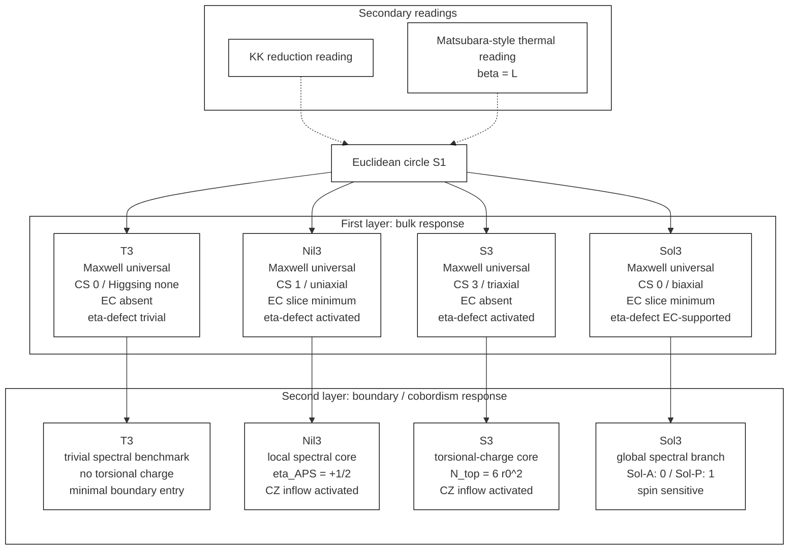

# Euclidean Geometric Response Dictionary and Selection Rules for Four Thurston Geometries

*4 つの Thurston 幾何に対する Euclidean geometric response dictionary と selection rules*

---

## Abstract

本論文では、Einstein-Cartan gravity with a Nieh-Yan term を $M^3 \times S^1$ 上の共通 minisuperspace 枠組みで解析し、4 つの Thurston 幾何 $T^3$, $Nil^3$, $S^3$, $Sol^3$ を横断する **Euclidean geometric response dictionary** と対応する **selection rules** を構成する。辞書は二層構造で整理される。第一層は homogeneous baseline と inhomogeneous / nonlocal response からなる bulk layer であり、36-entry inventory とともに Maxwell universality, Chern-Simons activation, Higgsing pattern, reduced $\eta$-mode defect-localization benchmark に関する geometry-dependent rule を与える。第二層は boundary / cobordism layer であり、spectral, torsional-charge, inflow の 3 family と、6 つの geometry pair 全てに対する pairwise cobordism dictionary を与える。この構造のもとで、 $Nil^3$ は strict な local APS spectral entry を、 $S^3$ は frame-bundle-normalized torsional-charge entry を与える。 $T^3$ は trivial spectral benchmark として機能し、 $Sol^3$ は compact mapping-torus benchmark 上で spin-structure-dependent な global spectral branch を与える。これにより spectral family の内部で local source と global source が区別される。得られた rules は、4 幾何にわたる allowed, protected, activated response を統一的に整理する。さらに、同じ Euclidean circle に対する二つの読みとして KK reduction reading と Matsubara-style thermal reading ( $\beta=L$ ) を与え、それらが理論的に同一視されないまま共存しうることを示す。

---

## 1. Introduction

### 1.1 背景

paper01 から paper03/03ec まででは、Einstein-Cartan + Nieh-Yan 理論の minisuperspace を、位相依存相分類、 $S^3 \times S^1$ の homogeneous mode dictionary、ならびに $T^3$ / $Nil^3$ / $S^3$ の比較という順で整備してきた [1–4]。とくに paper03ec [4] では、Levi-Civita と Einstein-Cartan の両方を含む homogeneous sector の mode dictionary と low-order EFT 言語が整備され、均質自由度の解析基盤が与えられた。

しかし、これらの先行結果だけでは、幾何ごとの mode content を越えて「どの応答がどの幾何で許され、保護され、活性化されるのか」を一望する辞書はまだ存在しない。とくに、bulk の非均質応答、boundary / interface 上の観測量、そして geometry pair 間の cobordism 的比較を同一の規約で並べるには、homogeneous baseline の上にさらに一段高い比較枠組みが必要である。

本稿の目的は、この比較枠組みを 4 つの Thurston [10] 幾何 $T^3$, $Nil^3$, $S^3$, $Sol^3$ に対して明示的に構成することにある。焦点は個々の mode の再導出ではなく、4 geometry を横断する response dictionary と、その内容を圧縮した selection rule の提示にある。

### 1.2 本稿の主張

本稿の中心命題は次の 4 点に要約される。

1. 4 つの Thurston 幾何 $T^3$, $Nil^3$, $S^3$, $Sol^3$ に対して、Euclidean response を first-layer bulk と second-layer boundary / cobordism の二層に分けて体系化できる。
2. first layer では 36-entry bulk inventory と geometry-dependent selection rules が閉じる。
3. second layer では spectral / torsional-charge / inflow の 3 family が閉じ、pairwise cobordism dictionary が 6 pair 全てに対して与えられる。
4. Euclidean circle は KK reduction reading と Matsubara-style thermal reading という二つの読みを許し、それぞれ reduced description と thermal description を与える。

本稿ではとくに、 $Nil^3$ の strict local APS spectral entry、 $S^3$ の frame-bundle-normalized torsional-charge entry、 $T^3$ の trivial spectral benchmark、そして compact Sol benchmark 上に現れる spin-sensitive global spectral branchを明示的に対比する。なお、 $Sol^3$ は CS direction count では inert だが EC slice minimum と rigid scaffold を持ち、boundary layer では compact quotient と spin structure に依存した spectral branch を許す distinct な entry を形成する。

### 1.3 本稿の比較視点

本稿の対象は、Euclidean product structure $M^3 \times S^1$ 上で定義される geometric response の比較と分類である。具体的には、4 geometry の homogeneous baseline、inhomogeneous / nonlocal bulk response、boundary / cobordism observables、pairwise cobordism dictionary、そして Euclidean circle の二つの読みを扱う。

比較の視点は三つある。第一に、各 geometry を単独に見たときの geometry-wise inventory である。第二に、observable を spectral / torsional-charge / inflow の 3 family に分ける taxonomy である。第三に、4 geometry から作られる 6 つの pair を比較単位とする pairwise cobordism dictionary である。これに geometric scaffold の情報を補うことで、observable の class と背景幾何の distinctness を区別しながら記述できる。

### 1.4 論文構成

本稿の構成は以下の通りである。[§2](DPPUv7-paper04_sec02.md) では homogeneous baseline を整理し、4 geometry を比較するための共通軸を固定する。[§3](DPPUv7-paper04_sec03.md) では inhomogeneous / nonlocal bulk response の first-layer inventory を与える。[§4](DPPUv7-paper04_sec04.md) では boundary / interface response を geometry-wise inventory, observable taxonomy, pairwise cobordism dictionary, geometric scaffold layer に分けて整理する。[§5](DPPUv7-paper04_sec05.md) では bulk と boundary を横断する selection rules を主結果としてまとめる。[§6](DPPUv7-paper04_sec06.md) では Euclidean circle の secondary readings として KK reduction reading と Matsubara-style thermal reading を記述する。[§7](DPPUv7-paper04_sec07.md) では本稿の位置づけと今後の展開を議論し、[§8](DPPUv7-paper04_sec08.md) で結論を述べる。付録では記号規約、完全 inventory、KK と Matsubara の coexistence table、normalization chain をまとめる。

**Fig. 1.** Two-layer architecture overview. First-layer bulk response と second-layer boundary / cobordism response を 4 geometry に沿って並べ、同じ Euclidean circle から生じる KK reduction reading と Matsubara-style thermal reading を secondary readings として分離して示す。

---

## 本文

- [§1 Introduction](DPPUv7-paper04_sec01.md)
- [§2 Homogeneous baseline](DPPUv7-paper04_sec02.md)
- [§3 Inhomogeneous / nonlocal bulk response](DPPUv7-paper04_sec03.md)
- [§4 Boundary / interface response](DPPUv7-paper04_sec04.md)
- [§5 Selection rules](DPPUv7-paper04_sec05.md)
- [§6 Secondary readings of the Euclidean circle](DPPUv7-paper04_sec06.md)
- [§7 Discussion and Outlook](DPPUv7-paper04_sec07.md)
- [§8 Conclusion](DPPUv7-paper04_sec08.md)

---

## 付録

- [Appendix A: Notation and conventions](DPPUv7-paper04_appA.md)
- [Appendix B: Full response inventories](DPPUv7-paper04_appB.md)
- [Appendix C: KK vs Matsubara coexistence tables](DPPUv7-paper04_appC.md)
- [Appendix D: Computational notes and normalization chain](DPPUv7-paper04_appD.md)
- [Appendix E: Derivations and proof sketches](DPPUv7-paper04_appE.md)

---

## 参考文献

1. Muacca, "Topology-Dependent Phase Classification of Effective Potentials in Einstein–Cartan + Nieh–Yan Minisuperspace," Zenodo. 10.5281/zenodo.18213677 (2026).
2. Muacca, "Structural Robustness of Isotropic $S^3$ Vacua in Einstein–Cartan Minisuperspace via Chiral Equilibrium and Weyl Stability," Zenodo. 10.5281/zenodo.18815498 (2026).
3. Muacca, "Unified Geometric Landau EFT of Homogeneous $S^3\times S^1$ Minisuperspace in Einstein–Cartan + Nieh–Yan Theory," Zenodo. 10.5281/zenodo.19144481 (2026).
4. Muacca, "Homogeneous Three-Topology Comparison and Mode Dictionary in Einstein–Cartan + Nieh–Yan Theory: Geometric Structure of EC–Weyl Coupling," Zenodo. 10.5281/zenodo.19425147 (2026).
5. F. W. Hehl, P. von der Heyde, G. D. Kerlick, and J. M. Nester, "General relativity with spin and torsion: Foundations and prospects," Rev. Mod. Phys. **48**, 393–416 (1976).
6. H. T. Nieh and M. L. Yan, "An identity in Riemann–Cartan geometry," J. Math. Phys. **23**, 373–374 (1982).
7. O. Chandia and J. Zanelli, "Topological invariants, instantons, and the chiral anomaly on spaces with torsion," Phys. Rev. D **55**, 7580–7585 (1997).
8. M. F. Atiyah, V. K. Patodi, and I. M. Singer, "Spectral asymmetry and Riemannian geometry. I," Math. Proc. Camb. Phil. Soc. **77**, 43–69 (1975).
9. A. N. Redlich, "Gauge noninvariance and parity nonconservation of three-dimensional fermions," Phys. Rev. Lett. **52**, 18–21 (1984).
10. W. P. Thurston, *Three-Dimensional Geometry and Topology, Vol. 1*, Princeton University Press (1997).
