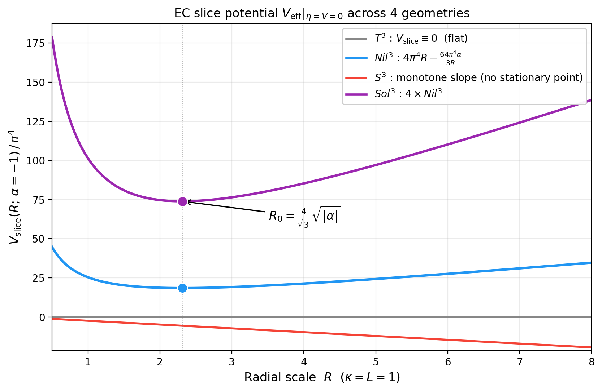
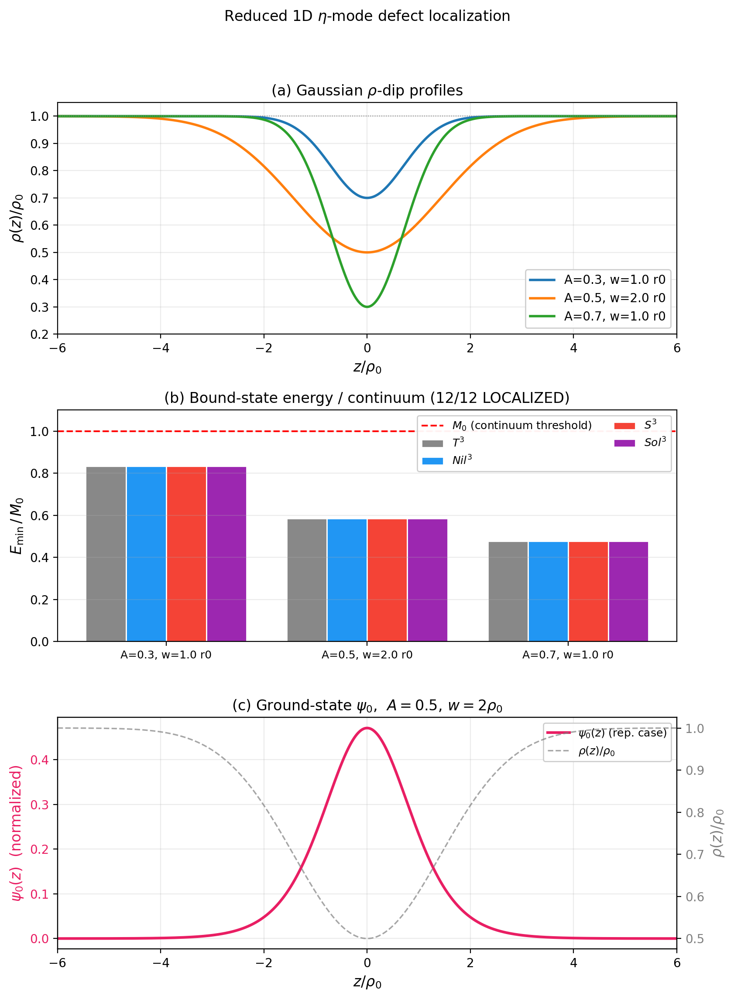

## 3. Inhomogeneous / nonlocal bulk response

本節では first-layer bulk response を扱う。ここでの目的は、4 geometry に対して nonlocal / inhomogeneous opening を許したとき、どの response entry が activated, protected, absent になるかを inventory と selection rule の形で固定することである。bulk layer は boundary を持たない setting で閉じているが、その内部だけで既に 4 geometry の応答地図は大きく分岐する。

### 3.1 Bulk layer の定義

first layer とは、boundary を導入しなくても bulk 側で定義できる response の層である。これには homogeneous baseline の延長としての Maxwell coefficient, Chern-Simons direction count, KK Higgsing pattern に加えて、EC slice minimum の有無、parity-odd transport の活性化、reduced $\eta$-mode defect-localization benchmark、inhomogeneous perturbation に対する opening pattern が含まれる。

complete bulk inventory は 4 geometry $\times$ 9 entry からなる 36-entry structure を持つ。本稿本文では full table 全体を再掲するのではなく、主結果を要約する compact table と、その table を rule set に圧縮した読み方を与える。完全版は付録 B に送る。

### 3.2 Bulk inventory の概要

主な bulk entry は次の通りである。

| entry | $T^3$ | $Nil^3$ | $S^3$ | $Sol^3$ |
|---|---|---|---|---|
| Maxwell 係数 | $-L^2/(2r_0^4)$ | $-L^2/(2r_0^4)$ | $-L^2/(2r_0^4)$ | $-L^2/(2r_0^4)$ |
| CS 方向数 | 0 | 1 | 3 | 0 |
| KK Higgsing 型 | none | uniaxial | triaxial | biaxial |
| EC slice minimum | absent | present | absent | present |
| P 線形輸送 | protected | activated | activated | protected |
| spin-2 rigidity | non-rigid | non-rigid | non-rigid | rigid |
| nonlinear opening | absent | absent | activated | absent |
| defect-localization response ( $\eta$ benchmark) | trivial | activated | activated | EC-supported / CS-inert |
| inhomogeneous bulk response | trivial | activated | activated | CS-inert / EC-active |

この table は、本稿の第一主結果が bulk layer における activation map そのものであることを示している。Maxwell coefficient は完全に universal である一方、CS direction count, Higgsing type, EC slice minimum, defect-benchmark response は geometry ごとに異なる。つまり、bulk layer の本質は「係数の差」よりも「許される応答の型の差」にある。

この inventory を rule の形で読めば、 $Nil^3$ は CS と EC slice minimum が同時に立ち上がる geometry、 $S^3$ は最も豊かな CS / Higgsing activated geometry、 $T^3$ は inert benchmark、 $Sol^3$ は CS-inert だが EC slice minimum と rigid scaffold を持つ geometry として位置づけられる。

### 3.3 Universal channel と activated channel

bulk layer の最重要式は、4 geometry すべてに共通する Maxwell baseline

$$
K_{{\rm Mxw},T^3}=
K_{{\rm Mxw},Nil^3}=
K_{{\rm Mxw},S^3}=
K_{{\rm Mxw},Sol^3}=-\frac{L^2}{2r_0^4}
$$

である。この普遍式は、4 geometry を同一辞書に載せるための基準面を与える。一方、geometry-dependent な差は Chern-Simons activation rule と Higgsing classification に現れる。 $Nil^3$ では 1 本の off-diagonal active direction が立ち、 $S^3$ では 3 方向すべてが等価に活性化する。これに対して $Sol^3$ では self-referential correction が相殺されるため

$$
{\rm CS}(R)=0
\qquad
\Longrightarrow
\qquad
\delta_{\rm CS}=0,\ \delta P = 0
$$

が代数的に保たれる。

この意味で $Sol^3$ は CS-active geometry ではない。ただし、 $T^3$ と異なり、 $Sol^3$ は biaxial KK splitting, frame rigidity, および EC slice-minimum branch を持つため、bulk layer でも完全な inert benchmark ではない。boundary layer ではさらに compact quotient / spin structure に依存した spectral branch の可能性が残るため、CS-inertness をそのまま second layer の triviality へ持ち上げてはならない。

この差の機構は geometry ごとに異なる。 $Sol^3$ では

$$
C^1{}_{01}=+\frac{1}{R}, \qquad C^2{}_{02}=-\frac{1}{R}
$$

という対称な構造定数の組により、non-abelian cubic correction が parity-odd channel を増やさない。具体的には ${A}\_{1} \to {{\tilde{F}}\_{01}}$, ${A}\_{2} \to {{\tilde{F}}\_{02}}$ の両補正の脚がそれぞれ {0,1}, {0,2} の **内側** に含まれるため、任意の profile-local scalar coefficients ${{c}\_{01}},{{c}\_{02}}$ に対して off-diagonal CS direction を生成しない（off-diagonal CS rule、詳細は [Appendix E.3](DPPUv7-paper04_appE.md) と [E.4](DPPUv7-paper04_appE.md)）。一方、 $Nil^3$ では非自明な構造定数が 1 方向だけ現れ、その一軸性が CS 1 方向 activation と EC slice-minimum branch の両方の起点になる。さらに $S^3$ では等方的な coupling structure が 3 方向の縮退を保ち、higher-order coupling を通じた nonlinear opening を許す。

**Fig. 2.** EC slice potential $V_{\rm eff}(\eta=V=0,R)$ の 4 geometry 比較。 $Nil^3$ と $Sol^3$ では stationary branch が現れ、 $Sol^3$ の slice potential は $Nil^3$ の 4 倍として表示される。 $T^3$ は flat zero slice、 $S^3$ は slope 非零で stationary point を持たない。

### 3.4 Reduced $\eta$-mode defect-localization benchmark

inward radial dip や localized defect を開くとき、本稿では 4 geometry を同一 footing で比較するために、slice-wise homogeneous background 上の reduced 1D AX-torsion ansatz

$$
\eta=\eta(z)
$$

を採用する。ここで radial scale を

$$
\rho(z)=r(z)\quad (T^3,S^3), \qquad \rho(z)=R(z)\quad (Nil^3,Sol^3)
$$

と書くと、局在化の benchmark operator は Sturm-Liouville 形

$$
-\frac{d}{dz}\!\left[K_{\rm geo}(z)\frac{df}{dz}\right] + M_{\rm geo}(z) f = E f,
\qquad
K_{\rm geo}(z)=M_{\rm geo}(z)=c_{\rm geo}\rho(z)
$$

に要約される。係数 $c_{\rm geo}$ は topology-dependent であり、

$$
c_{T^3}=c_{Nil^3}=c_{Sol^3}=\frac{96\pi^4 L}{\kappa^2},
\qquad
c_{S^3}=\frac{12\pi^2 L}{\kappa^2}
$$

となる。ここで $M_{\rm geo}$ は current `dppu` から得る exact homogeneous datum

$$
M_{\rm geo}=\left.\frac{\partial^2 V_{\rm eff}}{\partial\eta^2}\right|_{\eta=0},
$$

$K_{\rm geo}$ は AX contortion gradient から得る reduced 1D datum であり、両者の一致は [Appendix E.6](DPPUv7-paper04_appE.md) で確認する。

とくに Gaussian $\rho$-dip

$$
\rho(z)=\rho_0(1-Ae^{-z^2/w^2}), \qquad 0<A<1
$$

に対しては、試験関数 $f_\lambda=e^{-\lambda |z|}$ を用いた変分評価から $E_{\rm var}(\lambda)<M_0=c_{\rm geo}\rho_0$ が十分小さい $\lambda>0$ で従い、少なくとも 1 つの bound state の存在が解析的に示される（[Appendix E.6](DPPUv7-paper04_appE.md)）。したがって局在化自体はこの reduced benchmark のレベルで 4 geometry に共通して成立する。代表的な数値スキャンでも、4 geometry $\times$ 3 種の Gaussian $\rho$-dip profile の全 12 例で $E_{\min}<M_0$ が確認される（検証 `paper04/eta_defect_coefficients.py`, `paper04/defect_localization.py`）。

**Fig. 3.** Reduced $\eta$-mode defect-localization benchmark. Gaussian $\rho$-dip、有効ポテンシャル $M_{\rm geo}(z)$ 、束縛状態エネルギー $E_{\min}<M_0$ 、および ground-state wavefunction を同一の 1D benchmark として表示する。局在化そのものは 4 geometry に共通し、activation の差は後続の CS / EC / nonlinear structure によって決まる。

$T^3$ では、この共通 benchmark は kinematic / trivial 側に留まる。 $Sol^3$ では EC slice minimum が存在するため spin-0 sector は active だが、CS direction count は 0 のままで torsional-charge / local parity-odd activation へは進まない。これに対して $Nil^3$ では EC slice minimum と CS-active structure が組み合わさり、局在化した $\eta$ -mode が spectral / parity-odd channel の活性化と結びつく。 $S^3$ では triplet degeneracy と nonlinear opening が重なり、最も豊かな activation pattern が生じる。したがって row の `trivial / activated` は bound state の有無そのものではなく、共通の reduced $\eta$ benchmark がどの additional bulk structure と結びつくかを表している。

### 3.5 Geometry-wise な bulk reading

bulk layer の reading は 4 geometry ごとに次のように整理できる。

- $T^3$ : flat and inert. response は最小で、bulk entry の多くは trivial / protected である。比較辞書の基準 geometry として機能する。
- $Nil^3$ : first activated geometry. CS-active, EC slice minimum, uniaxial Higgsing を備え、境界で現れる strict APS spectral core へ自然に接続する。
- $S^3$ : richest activated geometry. isotropic degeneracy, activated parity-odd channel, nonlinear opening を持ち、boundary では frame-bundle-normalized torsional-charge core を与える。
- $Sol^3$ : CS-inert だが EC slice minimum, biaxial KK, frame rigidity を持つ distinct geometry である。boundary layer では compact quotient と spin structure に依存した global spectral branch を持ちうる。

### 3.6 本節のまとめ

bulk layer の意義は、4 geometry の response inventory を first-layer selection rule の形で閉じる点にある。ここで得られる整理は、後続の boundary / cobordism layer においても、「どの geometry でどの channel が非自明になるか」を判定する比較軸として再び用いられる。
