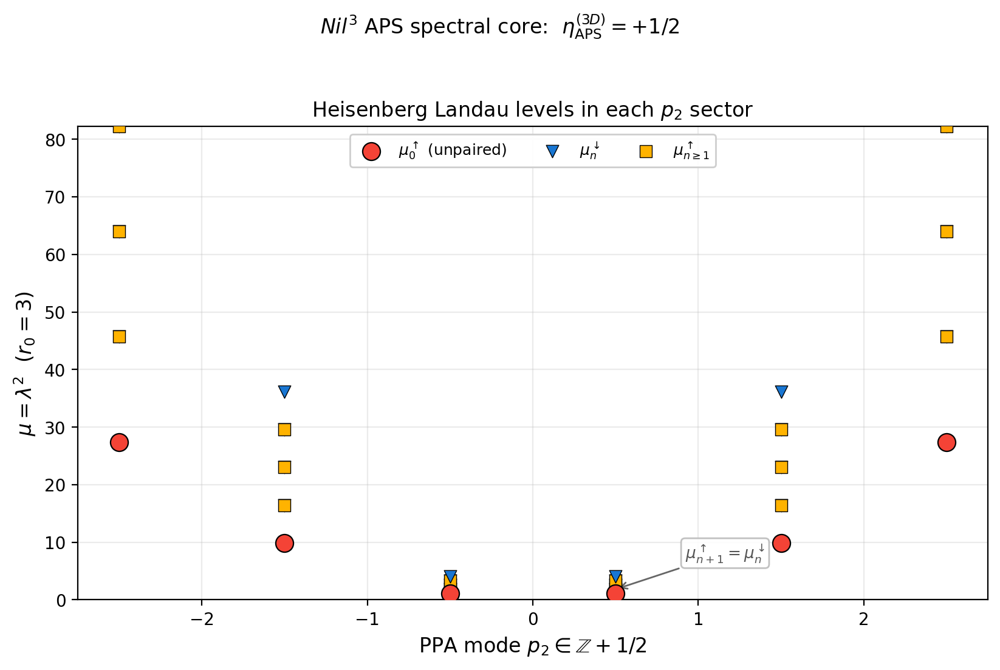
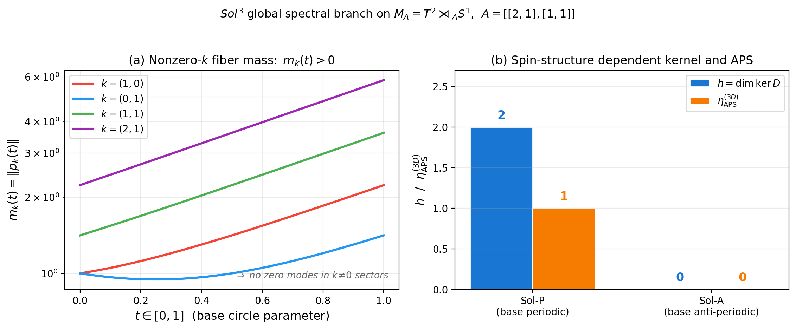
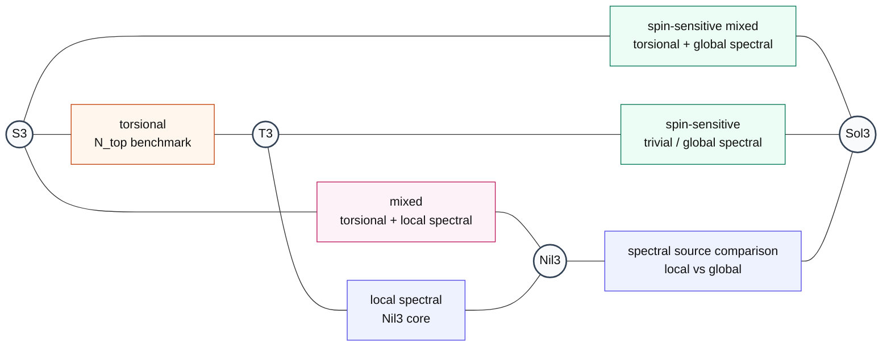
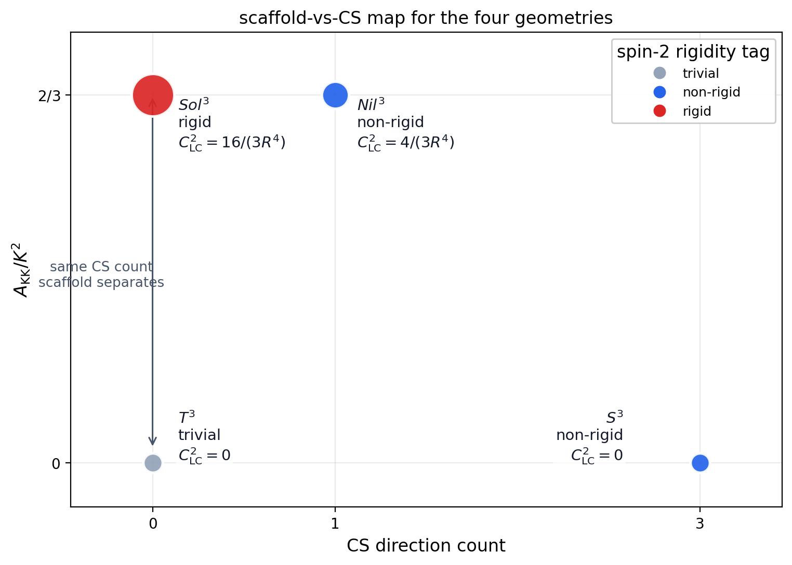

## 4. Boundary / interface response

本節では second-layer boundary / cobordism response を扱う。本節では geometry-wise inventory, observable taxonomy, pairwise cobordism dictionary, geometric scaffold layer を一つの構造として提示する。bulk layer が「各 geometry が単独で何を許すか」を主に扱うのに対し、second layer は「boundary 上で何が観測量として残るか」「geometry pair が何で比較可能か」を明示する。

### 4.1 CZ inflow and notation

second layer では、少なくとも 3 種類の 3-form を厳密に区別する必要がある。

- $\mathcal{C}_3^{\rm tor}$ : torsion-CS 3-form
- $\mathcal{C}_3^{\sigma}$ : spinor CS 3-form
- $\mathcal{C}_3^{\rm adj}$ : adjoint CS 3-form

本稿では CZ inflow [7] を

$$
S_{\rm CZ}[M_3] = \frac{k_{\rm cl}}{4\pi^2}\int_{M_3}\mathcal{C}_3^{\rm tor}
$$

で書く。これにより、

$$
{\rm NY}=d\mathcal{C}_3^{\rm tor}, \qquad d\mathcal{C}_3^{\rm tor} = T^a \wedge T_a + R_{ab} \wedge e^a \wedge e^b
$$

という Nieh-Yan と torsion-CS 3-form の関係から boundary inflow を直接つなぐことができる。一方、APS spectral entry [8] は Levi-Civita 接続のみで定義される 定義される ${\mathcal{C}}\_3^{\sigma} = {\rm Tr}_\sigma(\omega \wedge d\omega + {\tfrac{2}{3}}\omega^3)$ を経由するため、両者を混同してはならない。adjoint CS 3-form $\mathcal{C}_3^{\rm adj}$ は APS 議論の中間段階に現れるが、最終的な spectral observable そのものではない（3-form 区別の詳細は [Appendix E.8](DPPUv7-paper04_appE.md)）。

この区別は後続の taxonomy で本質的である。すなわち、 $Nil^3$ の strict APS entry と $S^3$ の frame-bundle-normalized torsional-charge entry は、ともに parity-odd boundary quantity ではあるが、同じ family には属さない。さらに spectral family の内部でも source は一様ではない。 $Nil^3$ の strict value は Levi-Civita spinor CS 積分が非零の local spectral core であるのに対し、compact $Sol^3$ benchmark で現れる APS branch は local CS 積分自体は零のまま kernel / spin-structure data から立ち上がる global spectral branch である。

### 4.2 Geometry-wise boundary inventory

boundary layer の geometry-wise inventory は次のように要約される。

| entry | $T^3$ | $Nil^3$ | $S^3$ | $Sol^3$ |
|---|---|---|---|---|
| CS interface jump | absent | present | present | absent |
| APS $\eta$ -invariant | $0$ | strict $+1/2$ (local) | $0$ | $0/1$ (Sol-A / Sol-P) |
| CZ inflow | absent | activated | activated | absent |
| edge / interface mode | minimal | activated | activated | spin-sensitive |
| boundary tag | trivial benchmark | APS local core | torsional-charge active | global spectral branch |

$Nil^3$ の主要 entry は strict APS spectral core であり、その代表値は

$$
\eta_{\rm APS}^{(3D)}(Nil^3)=+\frac{1}{2}
$$

である。Heisenberg モード分解は、PPA spin structure で $p_2 \in \mathbb{Z}+1/2$ となるため $p_2=0$ 零モードが排除され、 $n=0$ spin-up branch のみが spectral asymmetry を担うことを示す。一方、値そのものは Nil³ の Levi-Civita 接続から計算した spinor Chern-Simons 積分

$$
\int_Y \mathcal{C}_3^\sigma = -\frac{1}{2}
$$

と DPPU の向き規約 $\eta_{\rm APS} = -\int_Y \mathcal{C}_3^\sigma$ から

$$
\eta_{\rm APS}^{(3D)} = +\frac{1}{2}, \qquad \eta(0)=2\eta_{\rm APS}-h = 1
$$

として導かれる（[Appendix E.10](DPPUv7-paper04_appE.md); 検証 `paper04/eta_aps_nil3.py`）。ここで重要なのは、この spectral value が torsion-CS ではなく Levi-Civita spinor spectral data から得られる点である。 $Nil^3$ は同時に CZ inflow も持つが、strict core として前面に出るのは spectral family であり、しかもその source は local である。比較 benchmark として、 $T^3$ の PPA spin structure と round $S^3$ の Levi-Civita Dirac はいずれも厳密な $\lambda \leftrightarrow -\lambda$ 対称スペクトルを持ち $\eta_{\rm APS}=0$ である（検証 `proofs/aps_zero_t3_s3.py`）。

**Fig. 4.** $Nil^3$ Heisenberg Landau-level spectrum と $\eta_{\rm APS}$ の構築。PPA spin structure のもとで $n=0$ spin-up branch が spectral asymmetry を担い、Levi-Civita spinor CS 積分から $\eta_{\rm APS}^{(3D)}=+1/2$ が得られることを示す。

$Sol^3$ では事情が異なる。compact mapping-torus benchmark

$$
M_A=T^2\rtimes_A S^1,\qquad
A=\begin{pmatrix}2&1\\
1&1\end{pmatrix}
$$

と、DPPU で追跡している 2 つの spin structure `Sol-P / Sol-A` を採ると、local Levi-Civita Chern-Simons 積分そのものは

$$
\int_Y \mathcal{C}_3^\sigma = 0
$$

のままである。ここで `Sol-P` は base circle periodic / fiber periodic、`Sol-A` は base circle anti-periodic / fiber periodic の benchmark を表す。Dirac kernel は

$$
h(Sol\text{-}P)=2,\qquad h(Sol\text{-}A)=0
$$

と分岐し、反線形時間反転対称性から $\eta(0)=0$ なので

$$
\eta_{\rm APS}^{(3D)}(Sol\text{-}P)=1,\qquad
\eta_{\rm APS}^{(3D)}(Sol\text{-}A)=0
$$

を得る（[Appendix E.10b](DPPUv7-paper04_appE.md); 検証 `proofs/eta_aps_sol3.py`）。したがって $Sol^3$ は `local APS core` ではなく、compact quotient / spin structure によって on/off する global spectral branch として位置づけるのが正確である。

**Fig. 5.** $Sol^3$ の global spectral branch. Compact mapping-torus benchmark 上で `Sol-P` と `Sol-A` の kernel dimension $h$ と $\eta_{\rm APS}$ が分岐し、local CS 積分ではなく global / spin-structure data が spectral branch を on/off することを示す。

$S^3$ の主要 entry は frame-bundle-normalized torsional-charge core であり、

$$
N_{\rm top}=6r_0^2
$$

によって特徴づけられる。ここで幾何学的部分は、 $S^3$ の structure constants

$$
C^i{}_{jk}=\frac{4}{r_0}\epsilon^i{}_{jk}
$$

から

$$
T^i=\frac{1}{2}C^i{}_{jk}e^j\wedge e^k, \qquad
\mathcal{C}_3^{\rm tor}=e_i\wedge T^i=\frac{12}{r_0}\,{\rm vol}_{S^3}
$$

を経て ${\int_{S^3}}{\mathcal{C}}\_{3}^{\rm tor}=24{\pi}^{2} {r}\_{0}^{2}$ として得られる。一方、 ${1}/{4{{\pi}^{2}}}$ は frame bundle ${\pi\_{3}}(SO(3))=\mathbb{Z}$ による frame-bundle normalization（ ${T_{R}}=1$ ）であり、これを用いて ${N_{\rm top}}=6r_{0}^{2}$ が従う（[Appendix E.9](DPPUv7-paper04_appE.md)）。本稿では $r_0$ に追加の量子化条件は課していないため、ここでの $N_{\rm top}$ は frame-bundle-normalized torsional charge の値として扱う。interface CS jump と CZ inflow はこの torsional sector に属し、 $S^3$ が pairwise dictionary で torsional-charge 主導の geometry として現れる理由を与える。

$T^3$ は boundary entry がすべて trivial な benchmark である。一方 $Sol^3$ は CS-inert だが EC slice minimum と rigid scaffold を持ち、boundary layer では compact quotient / spin structure に応じて global spectral branch を持ちうる。したがって $T^3$ と $Sol^3$ を second-layer で同一 class に潰してしまうのは正確ではない。ただし $Sol^3$ が flat でない distinct な background geometry を持つこと自体は、boundary spectral branch の有無とは独立に保たれる。

### 4.3 Observable taxonomy

second-layer observable は次の 3 family で分類する。

| family | representative | carrier | value type | canonical geometry |
|---|---|---|---|---|
| spectral | $\eta_{\rm APS}^{(3D)}$ | Levi-Civita spectral data ($\mathcal{C}_3^\sigma$ and/or kernel / spin data) | half-integer / integer spectral branch | $Nil^3$ (local), $Sol^3$ (global) |
| torsional-charge | $N_{\rm top}$ | $\mathcal{C}_3^{\rm tor}$ の frame-bundle normalization | frame-bundle-normalized torsional charge | $S^3$ |
| inflow | $S_{\rm CZ}$ | $\mathcal{C}_3^{\rm tor}$ | boundary functional | $Nil^3$, $S^3$ |

本稿では、これら 3 family が second-layer observable taxonomy を与えるものとみなす。重要なのは、 $\eta_{\rm APS}^{(3D)}$ と $N_{\rm top}$ はともに非自明な boundary quantity であっても同一の型ではなく、互いに直接差し引くべき量ではないことである。pairwise comparison の際に普遍的に比較可能な量は、むしろ $\mathcal{C}_3^{\rm tor}$ によって書ける inflow functional の側にある。

### 4.4 Pairwise cobordism dictionary

4 geometry からは 6 つの pair が得られる。本稿では各 pair について dominant observable と source relation を整理する。

| pair | class | dominant observable | note |
|---|---|---|---|
| $S^3 \leftrightarrow T^3$ | torsional-trivial | frame-bundle-normalized torsional charge | $S^3$ benchmark |
| $S^3 \leftrightarrow Nil^3$ | torsional-local spectral | mixed | torsional-charge と local spectral が交差 |
| $S^3 \leftrightarrow Sol^3$ | torsional-global spectral | spin-sensitive | Sol-A では torsional-charge 主導, Sol-P では mixed |
| $T^3 \leftrightarrow Nil^3$ | trivial-local spectral | spectral | $Nil^3$ local core が主導 |
| $T^3 \leftrightarrow Sol^3$ | trivial-global spectral | spin-sensitive | Sol-A は trivial benchmark, Sol-P は global spectral |
| $Nil^3 \leftrightarrow Sol^3$ | local-global spectral | spectral | 同じ spectral family の source 比較 |

**Fig. 6.** Pairwise cobordism dictionary. 4 geometry を頂点とする pair graph として、6 pair の dominant observable と spin-sensitivity を表示する。 $S^3$ を含む pair は torsional-charge が主語になりやすく、 $Sol^3$ を含む pair では compact quotient / spin structure による global spectral branch が比較に入る。

この table は、geometry-wise inventory を pairwise cobordism language へ落としたものであり、本稿の比較論理を最も直接的に示す。とくに $S^3 \leftrightarrow Nil^3$ は torsional-charge family と local spectral family の交差を与え、 $Nil^3 \leftrightarrow Sol^3$ は同じ spectral family の内部で `local vs global` の source 差を与える。 $T^3 \leftrightarrow Sol^3$ も一意的な inert pair ではなく、Sol-A では trivial benchmark に重なり、Sol-P では global spectral branch が立ち上がる spin-sensitive pair となる。

pairwise dictionary の利点は、4 geometry を単独の inventory として並べるだけでは見えにくい「どの observable family が比較の主語になるか」と「その値が local か global か」を同時に明示できる点にある。 $S^3$ を含む pair が torsional-charge 主導、 $Nil^3$ を含む pair が local spectral 主導、 $Sol^3$ を含む pair が compact quotient / spin structure に応じて global spectral branch を持ちうることは、後の selection rule の簡潔な記述を可能にする。

### 4.5 Geometric scaffold layer

observable family ではないが、geometry を特徴づける background quantity として次の scaffold layer を併記する。

| geometry | $C^2_{\rm LC}$ | spin-2 rigidity tag | $A_{\rm KK}/K^2$ |
|---|---|---|---|
| $T^3$ | 0 | trivial | 0 |
| $Nil^3$ | $4/(3R^4)$ | non-rigid | $2/3$ |
| $S^3$ | 0 | non-rigid | 0 |
| $Sol^3$ | $16/(3R^4)$ | rigid | $2/3$ |

**Fig. 7.** scaffold-vs-CS scatter. 横軸は CS direction count、縦軸は $A_{\rm KK}/K^2$ 、点サイズは $C^2_{\rm LC}$ 、色は spin-2 rigidity tag を表す。 $T^3$ と $Sol^3$ は CS count では同じ 0 だが、scaffold layer では分離される。

ここで spin-2 rigidity tag は strict な数値不変量ではなく、squash / shear Hessian の零パターンを要約する scaffold label である。`rigid` は Sol³ の frame rigidity による

$$
\partial^2V/\partial\varepsilon^2=\partial^2V/\partial s^2=\partial^2V/(\partial\varepsilon\partial s)=0
$$

を表し、`trivial` は T³ の flat kinematic zero、`non-rigid` は Nil³ / S³ の非零 spin-2 Hessian を表す。

この Hessian 零パターンは、Sol³ の volume-preserving 変形 $f_1=(1+\varepsilon)^{2/3}(1+s),\,f_2=(1+\varepsilon)^{-2/3}/(1+s)$ の下で構造定数が $\varepsilon,s$ 非依存になる（[E.1](DPPUv7-paper04_appE.md)）ことから従う非自明な帰結であり、`proofs/sol3_structure.py` でこの 3 つの 2 階微分が直接零となることが verify される。

また KK anisotropy は

$$
A_{\rm KK}:=\sum_{i=0}^2 (m_i^2-\bar m^2)^2, \qquad \bar m^2:=\frac13\sum_{i=0}^2 m_i^2,
$$

を

$$
K^2:=K_{\rm Mxw}^2
$$

で規格化した量であり、本稿では $A_{\rm KK}/K^2 = 0,\,2/3,\,0,\,2/3$ を scaffold datum として記録する。

この層の役割は「新しい observable family を追加すること」ではなく、「なぜ 3 family の activation pattern が geometry ごとに異なるか」を説明することである。とくに $T^3$ と $Sol^3$ はどちらも local CS core を持たないが、bulk layer では EC slice minimum と rigid scaffold の有無で分離され、boundary layer では compact quotient / spin structure に応じて振る舞いがさらに分岐する。Sol-A benchmark では $T^3$ と同じ trivial spectral profile が現れる一方、Sol-P では $\eta_{\rm APS}=1$ の global spectral branch が立ち上がる。それでも $T^3$ が flat and inert であり、 $Sol^3$ が non-vanishing Weyl curvature, EC slice minimum, biaxial KK splitting, frame rigidity を持つという幾何学的差は不変である。この差は observable family の追加を意味しないが、geometry の完全な特徴づけには不可欠である。

以上により、second-layer dictionary は geometry-wise, pairwise, scaffold の三つの見方で閉じる。次節ではこれらを bulk layer と合わせ、個別計算の列挙ではなく selection rules の形へ圧縮する。
